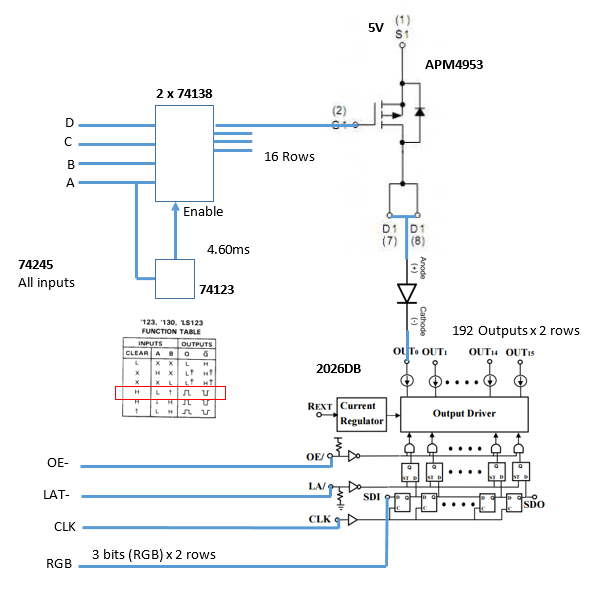

# LED64x32

Propeller driver for the MI-T21P3RGBE-AB 64x32 RGB LED Module. There is limited information about these
displays. What I have found on the web -- and by tracing connections on the board -- is here.

## Links

Adafruit sells the displays. There are a variety of sizes and resolutions. Here is the
display I am using: 
[https://www.adafruit.com/products/2279](https://www.adafruit.com/products/2279)

[https://learn.adafruit.com/32x16-32x32-rgb-led-matrix/](https://learn.adafruit.com/32x16-32x32-rgb-led-matrix/)

[https://learn.adafruit.com/32x16-32x32-rgb-led-matrix/connecting-with-jumper-wires](https://learn.adafruit.com/32x16-32x32-rgb-led-matrix/connecting-with-jumper-wires)

Some very old related information in the web archives:
[https://web.archive.org/web/20121201205905/http://www.hobbypcb.com/blog/item/3-16x32-rgb-led-matrix-technical-details.html](https://web.archive.org/web/20121201205905/http://www.hobbypcb.com/blog/item/3-16x32-rgb-led-matrix-technical-details.html)

Datasheet from the manufacturer:
[https://www.adafruit.com/images/product-files/2279/MI-T21P3RGBE-AB%20p3.pdf](https://www.adafruit.com/images/product-files/2279/MI-T21P3RGBE-AB%20p3.pdf)

The display driver chips used on the board:
[http://www.starchips.com.tw/pdf/datasheet/SCT2026V03_01.pdf](http://www.starchips.com.tw/pdf/datasheet/SCT2026V03_01.pdf)

## Hardware

The board has driver hardware for two display rows at a time. Each row is 64 cells. Each cell has a RED, a BLUE, and a GREEN LED in it.
3 x 64 = 192 LEDs per row. Two rows is 192 x 2 = 384 LEDs to drive at once.

This is the back of the board I have:

There are 24 LED driver chips along the top and bottom in the picture. The chips function as SCT2026 driver chips (see the link above).
Each chip can drive 16 LEDs. That's 24 x 16 = 192 x 2 = 384 LEDs.

There are 16 APM4953 chips down the middle of the picture. Each of these has 2 P-channel MOSFETs that feed the positive side of the LEDs. That's 
32 drivers. The driven LEDs thus share these drivers -- 12 LEDs to a MOSFET.

Near the left side of the picture (next to the input connector) there are 3 74245 chips. These boost/buffer the incoming signals. I was able to drive
the display from 3.3V GPIO pins.

The two other chips on the left side of the board are 74138. These are the row decoders. Together they generate 1 of 16 select lines. A single line
selects two rows at a time -- one in the top half of the display and one in the bottom half of the display.

The chip on the right side of the picture (next to the output connector) is a 74123 multivibrator chip. This chip feeds enable inputs on each of
the row decoder chips. After 4.6ms of inactivity the display is turned off until you start refreshing again (see circuit and discussion below).

I used a continuity checker and a scope to trace the connections. Here is a basic system diagram I was able to deduce:

The diagram only shows one LED. Remember there are 2 rows of 192 LEDs driven at once. There are six sets of shift registers -- R, G, and B for two
different rows. Only one line is shown at the bottom of the diagram. When the clock line goes from low to high the data is shifted through 
the registers.

When LAT goes from low to high the data from the shift registers passes through to the output driver. As long as LAT is high the outputs
will follow the shift register. When LAT goes from high to low the data is latched and held at the output drivers. This allows you to hold the LEDs
on while you shift in the data for the next row.

The OE controls the outputs of all the LEDs on the two driven rows. When OE is high, all of the LEDs are turned off.

The 74123 keeps the row drivers enabled. Whenever the A row input (least significant bit) goes from 0 to 1 the chip produces a low pulse (active low enable). As long as you are updating the display fast enough you'll retrigger the 74123 before the 4.6ms timeout. If you are too slow then the pulse will rise and the
rows will be disabled until your next even-to-odd row change.

The resistor and capacitor values are two small for me to read from the board, but I measured the 4.6ms timeout pulse using a scope.

You talk to the display with the input connector on the left side of the board. The right connector carries the shift registers through to
another display if you are chaining them.

Here is the pinout of the left connector:

## Protocol

Here is how you control the display:

1) The shift registers have been filled and latched, and the row lines have been set (see later steps below). Hold OE low to 
enable the output of the finished row.

2) Hold LAT low and clock the bits of RGB data into the shift registers. You are clocking in 6 bits at a time (R,G,B top and R,G,B bottom). The
data shifts in when the clock line goes from low to high. You'll do 64 clocks here (64 x 6 = 384 LEDs).

3) Turn OE high to disable the output while you change rows. It goes low again when you get back to step 1.

4) Pulse the LAT line from low to high to low to latch in the new data.

5) Change the row address pins to the new row address.

6) Go back to step 1

This is just one pass through the display loop. You can (quickly) control the color over time to produce different shades colors.

For instance, instead of lighting a green pixel ON every pass through the loop you might turn it ON ever other pass. If your loop is fast enough 
then the blinking will be imperceptible. Now you have two shades of green: bright (ON both passes) and dim (ON every other pass). 
How about dividing the time up into 3 slots? That gives you 4 shades of green, 4 shades of red, and 4 shades of blue. 4x4x4 = 64 colors at each pixel.

The more slots you want, the faster your display loop has to be to keep the blinking from being seen. You quickly run into speed limitations of your processor and/or the display itself.

## Propeller Code

The RGP.spin code contains some very basic tests. The code is written in SPIN, which is not particularly fast. This code is for demo and tinkering. The
real driver is written in assembly (coming soon).
